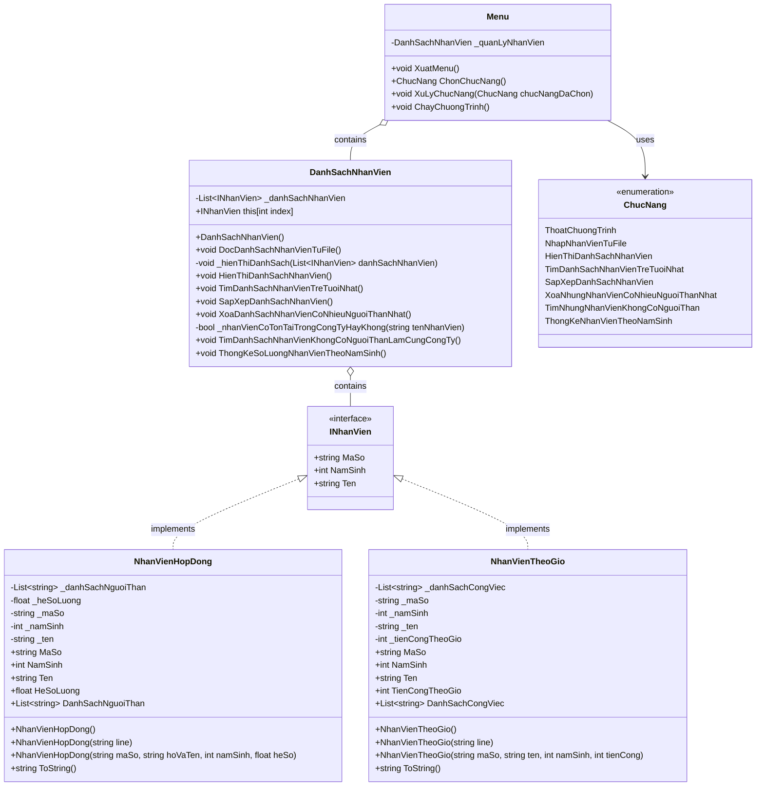

# Quản Lý Nhân Viên

Ứng dụng console C# quản lý thông tin nhân viên trong công ty.

## Mô tả

Dự án "Quản Lý Nhân Viên" là một ứng dụng console được phát triển bằng C# với mục đích giúp quản lý thông tin của các nhân viên trong một công ty. Hệ thống này được thiết kế để lưu trữ, truy xuất và xử lý thông tin của các loại nhân viên khác nhau.

Dự án này là kết quả của series bài giảng trên YouTube của kênh [DalatCoder](https://www.youtube.com/@DalatCoder), nhằm mục đích ôn tập và thực hành các kiến thức liên quan đến lập trình hướng đối tượng (OOP) với ngôn ngữ C#. Series bài giảng có thể được truy cập tại: [https://www.youtube.com/playlist?list=PLprElE4eCkKeHs9EWpQWr0AtxJD_16V8N](https://www.youtube.com/playlist?list=PLprElE4eCkKeHs9EWpQWr0AtxJD_16V8N).

Thông qua dự án này, người học có thể nắm vững các khái niệm cơ bản trong lập trình hướng đối tượng như: lớp, đối tượng, giao diện, kế thừa, đa hình, và áp dụng chúng vào việc giải quyết bài toán thực tế.

## Cấu trúc dự án

Dự án được tổ chức theo mô hình hướng đối tượng với các thành phần chính:

- **Giao diện INhanVien**: Định nghĩa thuộc tính chung cho tất cả các loại nhân viên.
- **Lớp NhanVienHopDong**: Đại diện cho nhân viên làm việc theo hợp đồng với hệ số lương và danh sách người thân.
- **Lớp NhanVienTheoGio**: Đại diện cho nhân viên làm việc theo giờ với mức lương theo giờ và danh sách công việc.
- **Lớp DanhSachNhanVien**: Quản lý danh sách nhân viên và cung cấp các chức năng xử lý.
- **Lớp Menu**: Tạo giao diện người dùng và xử lý tương tác.

## Chức năng

1. **Nhập dữ liệu từ file**: Đọc thông tin nhân viên từ file văn bản (Data.txt).
2. **Hiển thị danh sách nhân viên**: Hiển thị toàn bộ thông tin của nhân viên trong công ty.
3. **Tìm nhân viên trẻ tuổi nhất**: Tìm và hiển thị danh sách nhân viên có năm sinh gần đây nhất.
4. **Sắp xếp danh sách nhân viên**: Sắp xếp nhân viên theo năm sinh và tên.
5. **Xóa nhân viên có nhiều người thân nhất**: Loại bỏ những nhân viên hợp đồng có số lượng người thân nhiều nhất.
6. **Tìm nhân viên không có người thân làm cùng công ty**: Hiển thị danh sách nhân viên không có người thân làm việc tại công ty.
7. **Thống kê nhân viên theo năm sinh**: Tạo báo cáo thống kê số lượng nhân viên theo từng năm sinh.

## Sơ đồ lớp



## Các đối tượng chính

### Nhân Viên Hợp Đồng

- Mã số nhân viên
- Tên nhân viên
- Năm sinh
- Hệ số lương
- Danh sách người thân

### Nhân Viên Theo Giờ

- Mã số nhân viên
- Tên nhân viên
- Năm sinh
- Tiền công theo giờ
- Danh sách công việc

## Định dạng dữ liệu

Dữ liệu nhân viên được lưu trong file Data.txt với định dạng sau:

### Nhân viên hợp đồng:

```
HopDong;MaSo;HoTen;NamSinh;DanhSachNguoiThan;HeSoLuong
```

Ví dụ:

```
HopDong;HD10;Nguyen Lan Anh;1998;Nguyen Bao, Le Thi Lan;3.4
```

### Nhân viên theo giờ:

```
TheoGio;MaSo;HoTen;NamSinh;DanhSachCongViec;TienCongTheoGio
```

Ví dụ:

```
TheoGio;TG44;Tran Lan Huong;1991;Truc van phong;4000
```

## Cách sử dụng

1. Chạy ứng dụng console
2. Chọn chức năng từ menu bằng cách nhập số tương ứng:
   - 0: Thoát chương trình
   - 1: Nhập nhân viên từ File
   - 2: Hiển thị danh sách nhân viên
   - 3: Tìm danh sách nhân viên trẻ tuổi nhất
   - 4: Sắp xếp danh sách nhân viên theo năm sinh và tên
   - 5: Xóa những nhân viên có nhiều người thân nhất
   - 6: Tìm những nhân viên không có người thân làm cùng công ty
   - 7: Thống kê nhân viên theo năm sinh

## Yêu cầu hệ thống

- .NET 9.0 hoặc cao hơn
- Hệ điều hành hỗ trợ .NET (Windows, macOS, Linux)

## Cài đặt

1. Clone dự án từ repository:

```
git clone https://github.com/DalatCoder/quan-ly-nhan-vien.git
```

2. Đi đến thư mục dự án:

```
cd quan-ly-nhan-vien
```

3. Biên dịch và chạy dự án:

```
dotnet build
dotnet run --project QuanLyNhanVien/QuanLyNhanVien
```

## Cấu trúc thư mục

```
quan-ly-nhan-vien/
├── QuanLyNhanVien/
│   ├── QuanLyNhanVien/
│   │   ├── ChucNang.cs              # Enum các chức năng của ứng dụng
│   │   ├── DanhSachNhanVien.cs      # Quản lý danh sách nhân viên
│   │   ├── INhanVien.cs             # Giao diện cho các loại nhân viên
│   │   ├── Menu.cs                  # Xử lý menu và tương tác người dùng
│   │   ├── NhanVienHopDong.cs       # Lớp nhân viên hợp đồng
│   │   ├── NhanVienTheoGio.cs       # Lớp nhân viên theo giờ
│   │   ├── Program.cs               # Điểm khởi đầu của ứng dụng
│   │   ├── Data.txt                 # Dữ liệu nhân viên mẫu
│   │   └── QuanLyNhanVien.csproj    # File project
│   └── QuanLyNhanVien.sln           # Solution file
└── README.md                        # Tài liệu hướng dẫn (file này)
```
